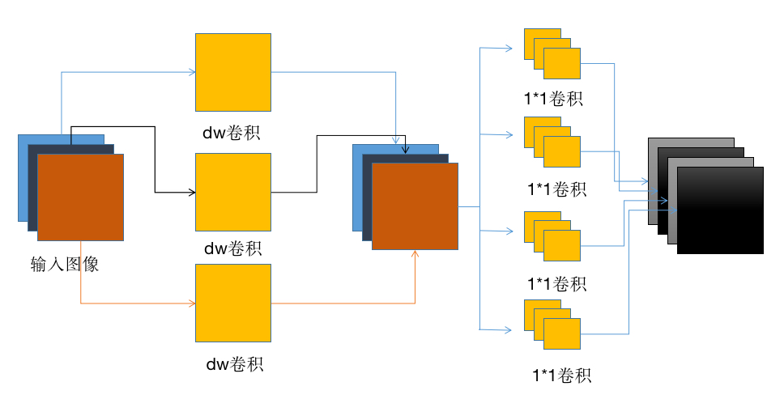
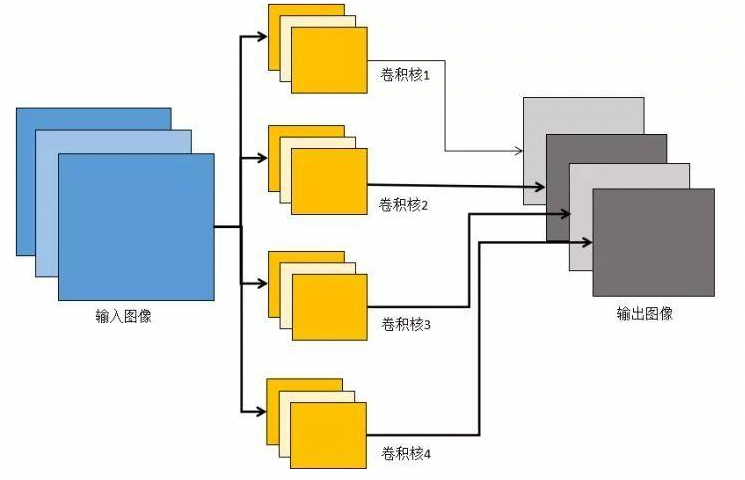

> 1、简述卷积的基本操作，并分析其与全连接层的区别。

  
答案

  卷积是通过指定大小的卷积核，用指定的步距在特征图上滑动进行矩阵计算。有时候会希望卷积的输入输出大小满足特殊的要求，可能会在进行卷积之前对特征图进行Padding，就是在特征图外圈补0。卷积与全连接层的主要区别在于，全连接层是点对点的连接的，而卷积具有局部连接以及权值共享的特点。

> 2、在卷积神经网络中，如何计算各层的感受野大小？

  
答案

  举个简单的例子，一个5 * 5的特征图， 用5 * 5的卷积核，步距为1对特征图进行卷积，输出的特征图为1 * 1的，所以1 * 1的输出在上一层5 * 5的特征图上的感受野面积大小就是25。

> 3、卷积层的输出尺寸、参数量和计算量。

  
答案

  输出尺寸 = （输入尺寸 + 2 * padding - 卷积核大小）/ 步距 + 1，一般是向下取整。Caffe和PyTorch会放弃输入特征图的左侧和上侧的一部分数据， 使得卷积核滑动窗恰好能到达最右下角的点。 
  卷积核的参数量 = 卷积核输入的通道数 * 输出的通道数 * 卷积核的长 * 卷积核的宽 
  计算量 = 卷积核的参数量 * 输出的长 * 输出的宽（输出的面积就是卷积计算的次数）

> 4、简述分组卷积及其应用场景。

  
答案

    传统卷积
    
     
    DW卷积
    
    分组卷积就是在输入的channal维度上分组，不同的组用不同的卷积来提取特征，经典的使用场景就是DW卷积，DW卷积先用分组卷积提取图像特征，在用1 * 1正常的卷积来修改输出的通道数，通过两步来实现正常的卷积功能，节省计算量。
  

